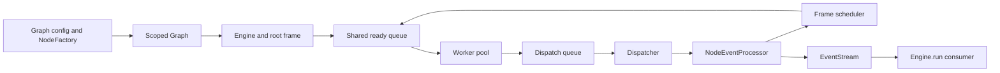

<!-- knowledge
last_checked: "2026-09-09T20:55:58Z"
-->
# Architecture

Current implementation; the metadata records the latest source and test review.
This is a navigation map, not a record of historical design decisions.
Contributor commands and contribution rules live in [CONTRIBUTING.md](CONTRIBUTING.md).

## Public entry points

Graphon is an embeddable Python workflow engine. The host application supplies
workflow configuration, inputs, integration adapters, and any persistence.
The top-level `graphon` package does not re-export its primary classes; import
them from the packages below.

| Surface | Entry point | Evidence |
| --- | --- | --- |
| YAML import and inspection | `graphon.dsl.inspect`, `graphon.dsl.loads` | [Importer](src/graphon/dsl/importer.py), [DSL tests](tests/dsl/) |
| Graph construction | `graphon.graph.Graph`, `GraphBuilder`, `NodeFactory` | [Graph implementation](src/graphon/graph/graph.py), [graph tests](tests/graph/test_graph.py) |
| Execution | `graphon.engine.Engine` | [Engine](src/graphon/engine/engine.py), [workflow tests](tests/workflows/test_full_engine_events.py) |
| Mutable execution data | `graphon.runtime.RuntimeState`, `VariablePool`, `InitParams` | [Runtime exports](src/graphon/runtime/__init__.py), [runtime tests](tests/runtime/) |
| Integration contracts | `graphon.protocols` | [Protocol exports](src/graphon/protocols/__init__.py), [export tests](tests/test_protocols_exports.py) |

The [Python example](examples/slim_llm/code.py) constructs nodes and an engine
directly. The [DSL example](examples/slim_llm/dsl.py) uses `loads()`, which builds
the variable pool, runtime state, node factory, graph, and engine. Built-in node
availability and default DSL support are separate concerns: inspect the
[DSL factory](src/graphon/dsl/node_factory.py) for its supported node types.

## Import boundaries

The [Import Linter layers contract](pyproject.toml) orders every top-level
`graphon` package and module from higher to lower responsibility:

| Layer, highest first | Packages and modules |
| --- | --- |
| Composition and adapters | `dsl` |
| Execution coordination | `engine` |
| Host-facing facade | `protocols`, `errors` |
| Workflow execution model | `graph`, `nodes`, `runtime`, `utils`, `variable_loader` |
| Event values | `engine_events`, `node_events` |
| Shared values and services | `entities`, `variables`, `file`, `http`, `model_runtime`, `enums`, `prompt_entities`, `template_rendering`, `workflow_type_encoder` |

Imports may stay within a layer or point downward. The colon-separated groups in
configuration allow their members to depend on each other. The rule includes
indirect imports and imports guarded by `TYPE_CHECKING`. Descendants inherit
their package's layer; the exhaustive contract requires every new top-level
package or module to be assigned explicitly.

The execution model shares graph/node schemas and
[container state](src/graphon/runtime/container_state.py);
[legacy snapshot migration](src/graphon/runtime/runtime_state/v2.py) uses graph
scoping, and [condition utilities](src/graphon/utils/condition/processor.py)
consume runtime interfaces. The public facade sits above this layer because it
re-exports `NodeFactory` and consumer contracts. These layers permit imports of
concrete node implementations from the facade; fresh-process tests below enforce
its node-registration guarantee.

Run `just imports`; the same contract runs through `just tc`, `just test`, and
CI's `just check`. [Layer regression tests](tests/test_import_layers.py) exercise
the real configuration against new upward imports and an unclassified module.

Default runtime construction and current snapshot restoration work without
loading the engine or registering built-in nodes. The old engine queue paths
re-export the same objects for compatibility; new runtime consumers use
`graphon.runtime.ready_queue`.
Importing `graphon.protocols` registers no nodes. Code/LLM package class exports
load their implementations only when explicitly requested; bare package or
contract-submodule imports do not register them. See
[runtime isolation](tests/runtime/test_runtime_imports.py) and
[public-contract isolation](tests/test_protocols_exports.py).

## Execution flow

1. [Graph.init](src/graphon/graph/graph.py) validates input IDs and edge fields,
   normalizes ownership, scopes the graph, and prevalidates node schemas,
   endpoints, and execution cycles throughout the retained subtree before
   constructing direct-frame nodes. Root type is checked on the resolved node.
   `Graph.new()` supplies the fluent builder for directly instantiated nodes and
   validates their graph at `build()`.
2. [Engine](src/graphon/engine/engine.py) binds a root frame, command processor,
   event stream, fixed worker pool, and dispatcher. Calling `run()` starts or
   resumes execution and yields graph lifecycle events plus processed node and
   traversal events.
3. [Scheduler](src/graphon/engine/scheduler.py) queues frame-qualified `StartTask`
   values. [Workers](src/graphon/engine/worker/worker.py) bind execution IDs,
   execute node generators inside [layer task contexts](src/graphon/engine/layer/README.md),
   and queue results.
4. [Node.run](src/graphon/nodes/base/node.py) wraps `_run()`, emits the start event,
   converts node payloads into engine events, and converts execution exceptions
   into failed-node events. Node implementations live in [nodes](src/graphon/nodes/).
5. [Dispatcher](src/graphon/engine/dispatcher.py) serializes result processing,
   external commands, and completion detection. Its
   [event processor](src/graphon/engine/event/processor.py) stores outputs,
   applies failure/retry policies, updates scheduling, and publishes events.
6. [EventStream](src/graphon/engine/event/stream.py) buffers events for the caller
   and notifies layers. `Engine.run()` emits terminal status and stops execution
   resources. A failed graph emits `GraphRunFailedEvent` and raises its error.

Response presentation is a consumer concern. `Engine.run()` yields raw engine
events; [filter_engine_events](src/graphon/engine/filter/chain.py) and
[ResponseStreamFilter](src/graphon/engine/filter/builtin/response_stream/filter.py)
can transform that stream separately. See [raw-event tests](tests/engine/test_raw_engine_events.py)
and [filter tests](tests/engine/test_event_filters.py).

## State and execution invariants

**One runtime per frame.** Every node in the root graph must hold the exact
`RuntimeState` instance passed to `Engine`. Each child frame has its own graph,
runtime counters, outputs, and variable pool; it shares the parent's ready and
deferred queues and workflow-wide `GraphExecution`. Fixed configuration belongs
in `InitParams`. See [frame construction](src/graphon/engine/frame.py),
[runtime state](src/graphon/runtime/runtime_state/state.py), and
[dispatch tests](tests/engine/test_dispatch_patterns.py).

**File adapters belong to the engine.** `Engine(file_runtime=adapter)` retains
that adapter; omitting it or passing `None` captures the current scope
at construction, including an unconfigured state. There is no process default.
Workers, the dispatcher, and
layer hooks bind it across root, child, and resumed execution. The caller's file
scope is restored before each event yield and after closing or failing the run.
`EngineEventFilterContext.from_engine()` carries the same adapter to
`ResponseStreamFilter`. Host rendering and custom filters can bind it explicitly
with `use_workflow_file_runtime(engine.file_runtime)`; scoped `None` disables
resolution. File values and snapshots contain no adapter, so hosts supply one
again when rebuilding an engine. See [file runtime](src/graphon/file/runtime.py)
and [execution isolation tests](tests/engine/test_file_runtime.py).

**Container scopes are explicit.** `data.container_id` is the canonical direct
owner; [scoping](src/graphon/graph/scoping.py) resolves supported legacy/editor
fields. A graph executes only its direct nodes while retaining descendant
configuration for later child construction. Cross-scope edges, orphaned or cyclic
ownership, and non-container owners are rejected. Edge IDs are local to a graph;
traversal events also carry `frame_id`. See [scoping tests](tests/graph/test_graph_scoping.py).

**Validate the subtree before constructing direct-frame nodes.**
`NodeFactory.validate_node()` must
resolve the same class/version as `create_node()` without constructing a node,
running `post_init()`, or initializing runtime dependencies. Factories rebind
runtime state and scoped graph configuration without mutating parent/sibling
configuration. Default construction rejects invalid or duplicate node IDs,
malformed edges, missing endpoints, and execution cycles throughout the retained
subtree, including inactive paths. Container handlers provide repetition; each
scope's edges must be acyclic. Root eligibility is checked afterward on the
constructed node, preserving custom factory aliases for loop and iteration
entry nodes.
`skip_validation=True` bypasses endpoint existence, root type, and cycle checks,
but still validates input fields, IDs, schemas, and ownership. The low-level
`Graph(...)` constructor remains trusted assembly. See
[factory contract](src/graphon/graph/graph.py), [validators](src/graphon/graph/validation.py),
and [scoping and preflight tests](tests/graph/test_graph_scoping.py).

**Joins wait for branch resolution.** A node with incoming edges is ready only
when none remain `UNKNOWN` and at least one is `TAKEN`. Branch completion selects
a source handle and propagates `SKIPPED` edges through inactive paths. See
[scheduler](src/graphon/engine/scheduler.py) and [scheduler tests](tests/engine/test_scheduler.py).

**Containers suspend worker tasks.** Loop and Iteration nodes yield
`ContainerAwaitRequest`; engine-owned handlers create child frames and enqueue
`ResumeTask` when the parent can continue. They use the same worker pool.
Child pools are copied. Loop variable-update events write back to existing
parent-pool variables through the dispatcher, continuing through nested Loops
but stopping at isolated Iteration pools. See [container effects](src/graphon/nodes/container_effects.py),
[handlers](src/graphon/engine/container_handler/builtin/), and
[cooperative execution tests](tests/engine/test_cooperative_container_execution.py).

**Pause is cooperative.** The dispatcher stops new task acquisition, defers
unstarted work, drains active workers, and snapshots child frames. It continues
processing commands while draining, so abort can supersede pause. Runtime
snapshots preserve scheduling and container progress; transient node attributes
and layer contexts are not persisted. See [dispatcher](src/graphon/engine/dispatcher.py),
[serialization tests](tests/engine/test_runtime_state_serialization.py), and
[layer context tests](tests/engine/test_layer_node_run_context.py).

**Snapshot compatibility is versioned.** `RuntimeState.dumps()` writes version
3.0; `from_snapshot()` selects `runtime_state/v<major>.py`. Old formats own their
migrations. A pending graph-aware migration requires graph attachment before
serialization. When saved graph state exists, attachment requires exact node/edge
IDs after migration. See
[snapshot loading](src/graphon/runtime/runtime_state/snapshot.py),
[runtime tests](tests/runtime/test_runtime_state.py), and
[version-isolation test](tests/test_snapshot_version_isolation.py).

**Public snapshots require quiescence.** `RuntimeState.dumps()` and its read-only
wrapper reject active engine runs and execution threads, including pause draining
and threads that outlive shutdown timeouts. A transient guard on the shared
[GraphExecution](src/graphon/runtime/execution.py) covers all frames and excludes
execution startup and other snapshot writers throughout serialization. Internal
frame snapshots remain engine operations. See
[serialization tests](tests/engine/test_runtime_state_serialization.py) for evidence.

## Extension seams

| Change | Start here | Existing check |
| --- | --- | --- |
| Add a node | [Node base class](src/graphon/nodes/base/node.py), [NodeFactory](src/graphon/graph/graph.py); import the subclass to register its type/version | [Node execution binding](tests/nodes/base/test_node_execution_binding.py), [factory tests](tests/dsl/test_node_factory.py) |
| Add lifecycle observation or limits | [Layer API and usage](src/graphon/engine/layer/README.md); runtime access is read-only, controls use commands | [Layer context tests](tests/engine/test_layer_node_run_context.py) |
| Pause, abort, or update variables externally | [Command API and channels](src/graphon/engine/command/README.md) | [Dispatch tests](tests/engine/test_dispatch_patterns.py) |
| Adapt the consumer event stream | [Filter protocol](src/graphon/engine/filter/protocol.py) | [Filter tests](tests/engine/test_event_filters.py) |
| Add a container kind | [ContainerHandler](src/graphon/engine/container_handler/protocol.py), `Engine(container_handler_factories=...)`, [persisted container state](src/graphon/runtime/container_state.py) | [Custom-container tests](tests/runtime/test_custom_container_state.py) |
| Replace model, code, HTTP, file, or tool integration | [Public protocols](src/graphon/protocols/__init__.py), concrete node constructors, [DSL adapters](src/graphon/dsl/) | [Protocol exports](tests/test_protocols_exports.py), matching node/adapter tests |

For graph-facing model execution, start with `LLMProtocol` and
[SlimLLM](src/graphon/dsl/slim/llm.py). Provider capability wrappers and schemas
are a separate surface documented in [model_runtime](src/graphon/model_runtime/README.md).
Check actual constructor usage before wiring an exported protocol:
[LLMNode](src/graphon/nodes/llm/node.py) currently ignores its legacy
`model_factory` and `credentials_provider` compatibility arguments.
