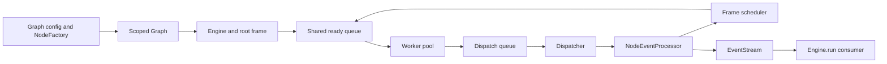

<!-- knowledge
last_checked: "2026-09-10T01:03:07Z"
-->
# Architecture

Current implementation; the metadata records the latest source and test review.
This is a navigation map, not a record of historical design decisions.
Contributor commands and contribution rules live in [CONTRIBUTING.md](CONTRIBUTING.md).

## Public entry points

Graphon is an embeddable Python workflow engine. The host application supplies
workflow configuration, inputs, integration adapters, and any persistence.
The top-level `graphon` package does not re-export its primary classes; import
them from the packages below.

| Surface | Entry point | Evidence |
| --- | --- | --- |
| YAML import and inspection | `graphon.dsl.inspect`, `graphon.dsl.loads` | [Importer](src/graphon/dsl/importer.py), [DSL tests](tests/dsl/) |
| Graph construction | `graphon.graph.Graph`, `GraphBuilder`, `NodeFactory` | [Graph implementation](src/graphon/graph/graph.py), [graph tests](tests/graph/test_graph.py) |
| Execution | `graphon.engine.Engine` | [Engine](src/graphon/engine/engine.py), [workflow tests](tests/workflows/test_full_engine_events.py) |
| Mutable execution data | `graphon.runtime.RuntimeState`, `VariablePool`, `InitParams` | [Runtime exports](src/graphon/runtime/__init__.py), [runtime tests](tests/runtime/) |
| Integration contracts | `graphon.protocols` | [Protocol exports](src/graphon/protocols/__init__.py), [export tests](tests/test_protocols_exports.py) |

The [Python example](examples/slim_llm/code.py) constructs nodes and an engine
directly. The [DSL example](examples/slim_llm/dsl.py) uses `loads()`, which builds
the variable pool, runtime state, node factory, graph, and engine. Built-in node
availability and default DSL support are separate concerns: inspect the
[DSL factory](src/graphon/dsl/node_factory.py) for its supported node types.

## Import boundaries

The [Import Linter configuration](pyproject.toml) is the source of truth for
allowed package dependencies. [Layer regression tests](tests/test_import_layers.py)
exercise enforcement in CI.

The execution model shares graph/node schemas and
[container state](src/graphon/runtime/container_state.py);
[legacy snapshot migration](src/graphon/runtime/runtime_state/v2.py) uses graph
scoping, and [condition utilities](src/graphon/utils/condition/processor.py)
consume runtime interfaces. The public facade sits above this layer because it
re-exports `NodeFactory` and consumer contracts. These layers permit imports of
concrete node implementations from the facade; fresh-process tests below enforce
its node-registration guarantee.

Import isolation and lazy registration are enforced by
[runtime import tests](tests/runtime/test_runtime_imports.py) and
[public-contract import tests](tests/test_protocols_exports.py). Use the public
runtime paths for new integrations; engine queue aliases exist for compatibility.

## Execution flow

1. [Graph.init](src/graphon/graph/graph.py) turns input configuration into a
   scoped executable graph. `Graph.new()` supplies the builder for directly
   instantiated nodes; see the [Python example](examples/slim_llm/code.py).
2. [Engine](src/graphon/engine/engine.py) binds a root frame, command processor,
   event stream, fixed worker pool, and dispatcher. Calling `run()` starts or
   resumes execution and yields graph lifecycle events plus processed node and
   traversal events.
3. [Scheduler](src/graphon/engine/scheduler.py) queues frame-qualified `StartTask`
   values. [Workers](src/graphon/engine/worker/worker.py) bind execution IDs,
   execute node generators inside [layer task contexts](src/graphon/engine/layer/README.md),
   and queue results.
4. [Node.run](src/graphon/nodes/base/node.py) wraps `_run()`, emits the start event,
   converts node payloads into engine events, and converts execution exceptions
   into failed-node events. Node implementations live in [nodes](src/graphon/nodes/).
5. [Dispatcher](src/graphon/engine/dispatcher.py) serializes result processing,
   external commands, and completion detection. Its
   [event processor](src/graphon/engine/event/processor.py) stores outputs,
   applies failure/retry policies, updates scheduling, and publishes events.
6. [EventStream](src/graphon/engine/event/stream.py) buffers events for the caller
   and notifies layers. `Engine.run()` emits terminal status and stops execution
   resources. A failed graph emits `GraphRunFailedEvent` and raises its error.

Response presentation is a consumer concern. `Engine.run()` yields raw engine
events; [filter_engine_events](src/graphon/engine/filter/chain.py) and
[ResponseStreamFilter](src/graphon/engine/filter/builtin/response_stream/filter.py)
can transform that stream separately. See [raw-event tests](tests/engine/test_raw_engine_events.py)
and [filter tests](tests/engine/test_event_filters.py).

## State and execution invariants

Execution state is owned by frames; shared queues and workflow execution connect
those frames without requiring nested worker pools. File adapters are host
resources owned by the engine, while snapshots contain portable state. These
boundaries let the host rebuild an execution with its own integrations.

The executable contracts below are authoritative for validation, lifecycle, and
compatibility details:

| Concern | Implementation | CI evidence |
| --- | --- | --- |
| Frame state and queue ownership | [Frame](src/graphon/engine/frame.py), [runtime state](src/graphon/runtime/runtime_state/state.py) | [Dispatch](tests/engine/test_dispatch_patterns.py) |
| File adapter binding and isolation | [File runtime](src/graphon/file/runtime.py), [engine](src/graphon/engine/engine.py) | [Execution file isolation](tests/engine/test_file_runtime.py), [file scopes](tests/file/test_runtime.py) |
| Container ownership and factory preflight | [Graph and NodeFactory](src/graphon/graph/graph.py), [scoping](src/graphon/graph/scoping.py), [validation](src/graphon/graph/validation.py) | [Graph scoping and validation](tests/graph/test_graph_scoping.py) |
| Branch joins and readiness | [Scheduler](src/graphon/engine/scheduler.py) | [Scheduling](tests/engine/test_scheduler.py) |
| Container suspension and variable propagation | [Container effects](src/graphon/nodes/container_effects.py), [handlers](src/graphon/engine/container_handler/builtin/) | [Cooperative execution](tests/engine/test_cooperative_container_execution.py), [nested workflow isolation](tests/workflows/test_full_engine_events.py) |
| Pause, resume, and snapshot quiescence | [Dispatcher](src/graphon/engine/dispatcher.py), [execution guard](src/graphon/runtime/execution.py) | [Serialization](tests/engine/test_runtime_state_serialization.py) |
| Snapshot versions and migrations | [Snapshot loading](src/graphon/runtime/runtime_state/snapshot.py) | [Runtime snapshots](tests/runtime/test_runtime_state.py), [version isolation](tests/test_snapshot_version_isolation.py) |

For host rendering, bind the engine's adapter with
[use_workflow_file_runtime](src/graphon/file/runtime.py); use
[EngineEventFilterContext.from_engine](src/graphon/engine/filter/protocol.py) to
wire response filters. Supply host adapters again when rebuilding from snapshots.

Persist after fully consuming the run iterator or from a quiescent `on_graph_end`
hook. Hosts must also coordinate direct mutation of exposed runtime objects: the
snapshot guard tracks engine activity, so it cannot protect arbitrary host writes.

## Extension seams

| Change | Start here | Existing check |
| --- | --- | --- |
| Add a node | [Node base class](src/graphon/nodes/base/node.py), [NodeFactory](src/graphon/graph/graph.py); import the subclass to register its type/version | [Node execution binding](tests/nodes/base/test_node_execution_binding.py), [factory tests](tests/dsl/test_node_factory.py) |
| Add lifecycle observation or limits | [Layer API and usage](src/graphon/engine/layer/README.md); runtime access is read-only, controls use commands | [Layer context tests](tests/engine/test_layer_node_run_context.py) |
| Pause, abort, or update variables externally | [Command API and channels](src/graphon/engine/command/README.md) | [Dispatch tests](tests/engine/test_dispatch_patterns.py) |
| Adapt the consumer event stream | [Filter protocol](src/graphon/engine/filter/protocol.py) | [Filter tests](tests/engine/test_event_filters.py) |
| Add a container kind | [ContainerHandler](src/graphon/engine/container_handler/protocol.py), `Engine(container_handler_factories=...)`, [persisted container state](src/graphon/runtime/container_state.py) | [Custom-container tests](tests/runtime/test_custom_container_state.py) |
| Replace model, code, HTTP, file, or tool integration | [Public protocols](src/graphon/protocols/__init__.py), concrete node constructors, [DSL adapters](src/graphon/dsl/) | [Protocol exports](tests/test_protocols_exports.py), matching node/adapter tests |

Use the [host integration guide](docs/development.md#integrate-host-services)
for adapter selection and [tracked LLM API debt](docs/technical-debt.md#td-06--ignored-llm-integration-arguments)
for compatibility arguments that have no effect.
