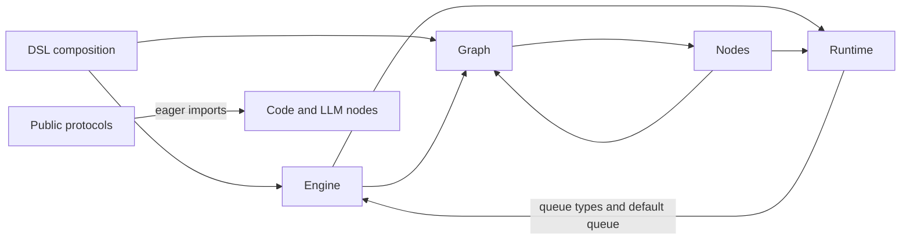

# Architecture review and technical debt

**Reviewed:** 2026-09-08, Graphon 0.7.0, commit
`9d13c716d527a8b7099df00cc448254ac7b6e98b`.
**Status:** original review complete; TD-02 implementation and reviews are complete
locally. TD-03 implementation and independent reviews are complete locally. Other
remediation remains proposed, not accepted architecture policy. Priorities express
the original review's judgment.
**Scope:** repository structure, execution and integration boundaries, developer
feedback, and knowledge maintenance. Evidence includes source, callers, test
definitions, focused tests, and small local reproductions. This is not a
production reliability assessment or a full security audit.

Graphon already has a coherent execution model and a useful repository knowledge
system. Preserve its frame isolation, explicit integration ports, versioned
snapshots, and separation of execution events from response presentation. The
highest-value changes are to reject lossy graph inputs, make execution boundaries
consistent at public APIs, and enforce a few dependency rules. A wholesale folder
reorganization would offer less value than those specific changes.

## Reading the article in Graphon's context

OpenAI's article connects agent effectiveness to navigable knowledge, executable
feedback, and mechanically enforced architecture. Its domain layers and explicit
provider interfaces constrain dependencies while leaving implementation choices
local. It also treats plans, decisions, and incremental debt cleanup as maintained
repository artifacts. Its relaxed merge gates depend on that team's operating
conditions; they are not a general recommendation to weaken checks.
See [Harness engineering](https://openai.com/index/harness-engineering/), especially
the knowledge, architecture, application legibility, and entropy sections.

For this library, apply those ideas through import constraints, contract tests,
offline execution examples, and focused performance checks. Its product does not
need the article's UI layer or a worktree-local observability service. Existing
layers and raw events already give hosts observation seams. Keep the current CI
and release checks unless repository evidence justifies a change.

The article is an engineering account, not a complete DDD specification. This
review additionally uses Eric Evans' concepts of bounded contexts, a shared
domain vocabulary, aggregate consistency, and translation between external
models. A directory is not automatically a bounded context; a frame is not a
separate business domain; a Pydantic class is not automatically a DDD entity.
See [DDD Reference](https://www.domainlanguage.com/wp-content/uploads/2016/05/DDD_Reference_2015-03.pdf),
printed pages 2–3, 15–16, 29, and 34. The following application to Graphon is this
review's interpretation.

## Current structure and domain map

These are responsibility boundaries inferred from the checkout, not newly
approved package names or team assignments.

| Area | Current home | Assessment |
| --- | --- | --- |
| Workflow execution, the core domain | [graph](../src/graphon/graph/), [engine](../src/graphon/engine/), [runtime](../src/graphon/runtime/), [node base](../src/graphon/nodes/base/) | These cooperate within one execution model. Scheduling, frame identity, lifecycle, and resume invariants justify the separation into modules, not separate services. |
| Node behavior | [nodes](../src/graphon/nodes/) | Grouping each node's data and behavior by capability is useful. Base-node infrastructure is shared; a new node type does not require a new bounded context. |
| Model capabilities and provider metadata | [model_runtime](../src/graphon/model_runtime/README.md) | A supporting model with its own vocabulary. Graph-facing invocation and provider capability wrappers serve different clients; preserve their distinction. |
| External Dify configuration and composition | [dsl](../src/graphon/dsl/), [scoping](../src/graphon/graph/scoping.py) | `inspect()` and `loads()` translate external configuration and assemble the engine. Legacy owner normalization also lives in graph scoping because direct graph construction accepts those forms. |
| Files, HTTP, code, and tools | [file](../src/graphon/file/), [http](../src/graphon/http/), [node ports](../src/graphon/nodes/protocols.py), [DSL adapters](../src/graphon/dsl/node_factory.py) | Mostly explicit host integration seams. File runtime lookup still introduces ambient process state. |
| Values and public event language | [variables](../src/graphon/variables/), [entities](../src/graphon/entities/), [node events](../src/graphon/node_events/), [engine events](../src/graphon/engine_events/) | Useful shared vocabulary. These folders contain schemas and transport values as well as domain concepts; their names do not establish ownership or DDD semantics by themselves. |
| Consumer presentation | [event filters](../src/graphon/engine/filter/) | Raw execution and response formatting are separate APIs despite filters living under `engine/`. That behavioral boundary matters more than moving the folder. |
| Public integration facade | [protocols](../src/graphon/protocols/__init__.py) | Discoverable re-exports are useful. Importing them should not implicitly register concrete nodes. |
| Host application | Outside this repository | Owns tenant policy, credentials, persistence, and presentation. Graphon should expose the needed ports and retain opaque host references. |
| Engineering feedback and knowledge | [tests](../tests/), [benchmarks](../benchmarks/), [examples](../examples/), [docs](README.md), [CI](../.github/workflows/) | Existing checks and navigation are valuable. Gaps are specific: dependency enforcement, a public offline example, and performance coverage of a known hot path. |

An import scan of all 276 Python source files, including local and type-checking
imports, found the following selected relationships. This diagram shows current
coupling, not a proposed permitted-dependency graph:



The graph/node relationship partly reflects graph-aware container behavior;
it is not evidence that every reciprocal package import is a bug. The runtime
queue dependency and facade side effects below have concrete isolation costs.

## What is working well

- **Knowledge is discoverable and already checked.** [AGENTS.md](../AGENTS.md)
  is a short map, [architecture](../ARCHITECTURE.md) explains real invariants,
  and [development navigation](development.md) links source to tests.
  [The documentation test](../tests/test_repository_docs.py) checks local links
  and reachability. Its stated limitation—no semantic freshness guarantee—is
  honest and appropriate.
- **Execution ownership is explicit.** [FrameRegistry](../src/graphon/engine/frame.py)
  creates frame-local state while sharing workflow identity and queues. The
  [dispatcher](../src/graphon/engine/dispatcher.py) serializes result and command
  processing. [Container tests](../tests/engine/test_cooperative_container_execution.py)
  and [dispatch tests](../tests/engine/test_dispatch_patterns.py) exercise these
  boundaries. Preserve this model rather than adding per-container worker pools.
- **Validation and translation have real seams.** The
  [factory contract](../src/graphon/graph/graph.py) separates schema preflight
  from construction. [Factory tests](../tests/dsl/test_node_factory.py) protect
  validation before adapter initialization. Canonical ownership and explicit
  legacy translation in [scoping](../src/graphon/graph/scoping.py) are useful
  protections; TD-02 addresses the structural gaps found in the original review.
- **Ports mostly follow actual consumers.** HTTP nodes capture their injected
  client, code nodes accept an executor, and provider wrappers require only
  their capability contracts. [Model dispatch tests](../tests/model_runtime/test_model_dispatch.py)
  demonstrate narrowly implemented adapters. Keep these ports near their
  consumers and use the facade for discovery.
- **Snapshot compatibility has an executable retirement boundary.** Separate
  [version codecs](../src/graphon/runtime/runtime_state/) own old formats.
  [The isolation test](../tests/test_snapshot_version_isolation.py) proves current
  runtime and response-filter snapshots work without obsolete version modules.
  Graph attachment checks saved identities, and
  [RuntimeState](../src/graphon/runtime/runtime_state/state.py) defensively copies
  outputs. TD-03 concerns when a snapshot is taken, not format compatibility.
- **Events and observation are separated from presentation.**
  [Node payloads](../src/graphon/node_events/) are enriched into
  [engine events](../src/graphon/engine_events/); [layers](../src/graphon/engine/layer/README.md)
  observe lifecycle and use commands for control. [Raw-event](../tests/engine/test_raw_engine_events.py)
  and [filter tests](../tests/engine/test_event_filters.py) protect the consumer
  boundary. An event stream alone does not make this an event-sourced system.
- **Developer and CI commands agree.** [Contributing](../CONTRIBUTING.md),
  [justfile](../justfile), and [CI](../.github/workflows/test.yml) use the same
  tools, with Python 3.12/3.13 coverage. The
  [release workflow](../.github/workflows/release.yml) tests before building and
  promotes the same artifacts. No concrete need for a new CI framework emerged.

## Debt register

TD-02 and TD-03 are **implemented locally**; other entries remain **proposed**. P1
means a reproduced correctness problem or a boundary that must be addressed before
the stated deployment use. P2 is targeted architecture or feedback work. P3 can
follow the more consequential changes.
Suggested owners are responsibility areas, not assigned people; effort is a
relative change size, not a delivery estimate.

| ID | Section | Priority | Suggested owner | Size |
| --- | --- | --- | --- | --- |
| TD-01 | Dependency direction and runtime queue ownership | P2 | Engine/runtime | Medium |
| TD-02 | [Graph construction and structural validation](#td-02--graph-construction-and-structural-validation), implemented locally | P1 | Graph/DSL | Medium |
| TD-03 | [Snapshot consistency at the public boundary](#td-03--snapshot-consistency-at-the-public-boundary), implemented locally | P2 | Runtime/engine | Medium |
| TD-04 | Execution-scoped file integration | P2; P1 before concurrent distinct host adapters | File/host integration | Medium–large |
| TD-05 | Side effects of importing public contracts | P2 | Public API/node bootstrap | Small–medium |
| TD-06 | Ignored LLM integration arguments | P2 | Model/node API | Small, with a compatibility window |
| TD-07 | Optional capability dependencies | P2 | Packaging/document extraction | Medium |
| TD-08 | Offline execution and diagnostic example | P2 | Examples/developer experience | Small |
| TD-09 | Performance feedback for expensive phases | P2 | Filters/performance | Small–medium; overlaps open work |
| TD-10 | Decision memory and debt maintenance | P3 | Maintainers/docs | Small; overlaps open work |

## TD-01 — Dependency direction and runtime queue ownership

**Working well:** runtime already has a queue protocol and a small
[GraphProtocol](../src/graphon/runtime/runtime_state/protocol.py), so it need not
depend on the whole execution implementation to describe state.

**Evidence and consequence:** [RuntimeState._new_ready_queue](../src/graphon/runtime/runtime_state/state.py)
imports `engine.ready_queue.InMemoryReadyQueue`.
[The runtime queue protocol](../src/graphon/runtime/ready_queue.py) imports task
values from `engine.ready_queue.entities`, and the
[v1 loader](../src/graphon/runtime/runtime_state/v1.py) imports `StartTask` there.
The engine imports runtime in return. A fresh-process probe confirmed that
constructing a default runtime loads `graphon.engine.engine` and a concrete Loop
node. The local import postpones this coupling; it does not remove it.
The [tool configuration](../pyproject.toml) has no general package import rule.

**Proposed change:** move the existing task values and in-memory queue to a
runtime-owned queue package, retaining engine-path compatibility re-exports.
Reuse the existing protocol. Add a short dependency table to architecture and
targeted structural checks: runtime must not import the engine implementation;
execution core must not import concrete DSL/Slim adapters. Describe legitimate
schema dependencies and any temporary exceptions explicitly. Do not require
every package to fit a universal layer sequence or introduce a new DI framework.

**Done when:** a fresh-process runtime construction and current snapshot
round-trip do not load engine implementations or built-in nodes; existing custom
queue and historical snapshot tests pass; an intentionally forbidden import is
detected with a message naming the boundary and the correct home. Follow the
subprocess pattern in [snapshot isolation](../tests/test_snapshot_version_isolation.py)
and retain [runtime coverage](../tests/runtime/test_runtime_state.py).

## TD-02 — Graph construction and structural validation

**Implementation update (2026-09-08):** implemented locally by the current
Graph/DSL development task on `laipz8200/graph-validation`; independent reviews and
checks are complete. The [graph validation plan](plans/graph-validation.md) records decisions,
checks, and tracking. [Implementation issue #277](https://github.com/langgenius/graphon/issues/277)
tracks this fix and its pull request;
[issue #131](https://github.com/langgenius/graphon/issues/131) remains related
authoring work.

**Original evidence:** direct `Graph.init()` silently overwrote duplicate node IDs
and discarded malformed edges. Default validators accepted execution cycles, so
`start → a → b → a` could emit `GraphRunSucceededEvent` after only `start` ran,
leaving `a` and `b` `UNKNOWN`. Public `dsl.loads()` reproduced that false success.
The DSL normalizer already rejected some invalid inputs, but these checks did
not establish a shared construction boundary.

**Current result:** [graph construction](../src/graphon/graph/graph.py) rejects
invalid/duplicate IDs and malformed edges before indexing or filtering.
[Shared validation](../src/graphon/graph/validation.py) checks endpoints and cycles
throughout the retained subtree before node construction and through the Python
builder. [DSL loading](../src/graphon/dsl/importer.py) preserves structured
validation issues. Scheduler behavior is unchanged. Supported ownership forms,
resolved factory root types, edge identities, and trusted bypasses are retained;
see the [migration guidance](../MIGRATION.md#graph-validation).

**Evidence of remediation:** [scoping tests](../tests/graph/test_graph_scoping.py),
[builder tests](../tests/graph/test_graph.py), and
[public loading tests](../tests/dsl/test_importer.py) cover the defects and valid
controls. The focused graph/DSL command passes 136 tests; `just test` passes 815,
and `just check` passes on Python 3.12.13. The plan records the initial failures,
full-suite caveat, and remaining validation limits. This is local implementation
evidence, not a merged fix or a release claim.

## TD-03 — Snapshot consistency at the public boundary

**Implementation update (2026-09-08):** implemented locally for
[issue #279](https://github.com/langgenius/graphon/issues/279), with independent test,
knowledge, and naming reviews complete. The
[snapshot eligibility plan](plans/snapshot-eligibility.md) records scope, decisions,
and checks.

**Original evidence:** public runtime and layer snapshots could read graph state,
variables, execution state, and shared queues during execution. Queue serialization
requires quiescence, but the public boundary did not enforce it. Pause and
completion flags did not prove worker/dispatcher inactivity, especially after
bounded shutdown joins. The original review identified a consistency risk without
reproducing concurrent corruption.

**Current result:** [RuntimeState.dumps](../src/graphon/runtime/runtime_state/state.py)
enforces [quiescent snapshots](../ARCHITECTURE.md#state-and-execution-invariants) across
all frames, including threads that outlive shutdown. Internal frame snapshots and
persisted formats are unchanged. The
[migration guidance](../MIGRATION.md#snapshot-eligibility) defines the public
contract and host responsibilities.

**Evidence of remediation:** six new
[serialization cases](../tests/engine/test_runtime_state_serialization.py) reproduce
and prevent active callback snapshots, paused child-frame snapshots, snapshots
while threads outlive shutdown, and concurrent startup/writer overlap. Focused
compatibility and full-suite results are recorded in the plan. This is local
implementation evidence, not a merge or release claim.

## TD-04 — Execution-scoped file integration

**Working well:** [File](../src/graphon/file/models.py) carries metadata and opaque
references rather than tenant policy. Existing file and node protocols already
describe the necessary host services. HTTP nodes capture their injected client,
which is a useful existing pattern.

**Evidence and consequence:** [file/runtime.py](../src/graphon/file/runtime.py)
holds one mutable process registry. `File.generate_url()`, `to_dict()`, Markdown,
and plugin parameter conversion reach it through
[helpers](../src/graphon/file/helpers.py).
[File manager](../src/graphon/file/file_manager.py) performs further global
lookups. Callers include file URL selectors in
[VariablePool](../src/graphon/runtime/variable_pool.py),
[LLM prompt compilation](../src/graphon/nodes/llm/llm_utils.py), and
[document extraction](../src/graphon/nodes/document_extractor/node.py).
A probe showed the same File switching from `host-a/file-a` to `host-b/file-a`
when a second runtime was installed. This demonstrates dependency switching,
not an observed authorization incident. One process-wide adapter remains a
valid deployment choice; concurrent distinct host adapters are not isolated.

**Proposed change:** retain or pass the execution's `WorkflowFileRuntimeProtocol`
through resolution, prompt conversion, and download callers. Reuse existing
ports and preserve a documented process-default fallback during migration.
Keep metadata serialization usable independently of URL resolution. Merely
replacing the registry with a `ContextVar` is insufficient without propagating
the binding to worker threads and event consumers. Keep host credentials and
runtime objects out of persisted file values.

**Done when:** two interleaved executions resolve their own URLs and bytes through
selectors, prompts, and extraction, including resumed work; metadata and legacy
references round-trip. Extend [file runtime tests](../tests/file/test_runtime.py)
and the relevant node tests. The existing tests verify registry behavior, not
execution isolation. [Merged PR #69](https://github.com/langgenius/graphon/pull/69)
is relevant history for explicit configuration, not proof of concurrent isolation.

## TD-05 — Side effects of importing public contracts

**Working well:** [graphon.protocols](../src/graphon/protocols/__init__.py) gives
integrators a stable discovery surface and
[export tests](../tests/test_protocols_exports.py) preserve object identity.

**Evidence and consequence:** the facade imports `CodeExecutorProtocol` from
[code_node.py](../src/graphon/nodes/code/code_node.py). Importing LLM contract
submodules executes [llm/__init__.py](../src/graphon/nodes/llm/__init__.py), which
imports `LLMNode`. [Node.__init_subclass__](../src/graphon/nodes/base/node.py)
registers implementations on import. A fresh-process probe that imported Node,
captured its registry, then imported `graphon.protocols` added `code` and `llm`.
A declaration import therefore changes executable availability. Existing export
identity tests do not detect this because implementations are already imported.

**Proposed change:** move the code executor contract out of the implementation
module, and make LLM contract imports independent of eager implementation
imports. Preserve current explicit node import paths and their intended
registration, using a compatibility export only where needed. Retain
consumer-owned contracts; no universal contract hierarchy or replacement plugin
discovery system is necessary.

**Done when:** a fresh-process public-contract import adds no concrete node
registrations, explicit imports still register those nodes, and existing public
export identities remain valid. Add this check beside
[protocol exports](../tests/test_protocols_exports.py). Coordinate with TD-01,
since runtime construction can otherwise load nodes indirectly.

## TD-06 — Ignored LLM integration arguments

**Working well:** prepared `model_instance` injection is the actual graph-facing
model seam; capability wrappers remain separate. The
[model runtime guide](../src/graphon/model_runtime/README.md) distinguishes them.

**Evidence and consequence:** [LLMNode](../src/graphon/nodes/llm/node.py),
[QuestionClassifierNode](../src/graphon/nodes/question_classifier/question_classifier_node.py),
and [ParameterExtractorNode](../src/graphon/nodes/parameter_extractor/parameter_extractor_node.py)
accept and discard `credentials_provider` and `model_factory`; the first two
also discard `http_client`. Yet [ModelFactory and CredentialsProvider](../src/graphon/nodes/llm/protocols.py)
remain publicly exported with active-sounding descriptions. Architecture notes
the LLM compatibility case, but [MIGRATION.md](../MIGRATION.md) does not explain
this transition across the three nodes. Callers can supply configuration that
has no effect.

**Proposed change:** document actual replacements for each argument and choose a
compatibility window. Deprecate or reject supplied non-`None` ignored arguments
according to that window, then remove them at the agreed boundary. Keep
compatibility exports only as long as required. Do not implement an unused
factory merely to justify its existing parameter: [issue #128](https://github.com/langgenius/graphon/issues/128)
explicitly deferred that higher-level resolver work.

**Done when:** tests cover supplying the ignored arguments on all three nodes,
the documented transition matches observed behavior, and examples use effective
dependencies. Preserve [LLM tests](../tests/nodes/llm/test_node.py),
[classifier tests](../tests/nodes/question_classifier/test_question_classifier_node.py),
and [extractor tests](../tests/nodes/parameter_extractor/test_prompts.py).
Removing public parameters requires a compatibility decision, not a silent cleanup.

## TD-07 — Optional capability dependencies

**Working well:** specialized behavior is mostly localized in concrete nodes,
and [pyproject.toml](../pyproject.toml) honestly explains the interpreter limit.

**Evidence and consequence:** document-extraction packages such as pandas, PDF
readers, office parsers, and `unstructured` are mandatory dependencies for all
Graphon users. [The extractor](../src/graphon/nodes/document_extractor/node.py)
imports several eagerly. The project's Python upper bound is explicitly tied
to `unstructured`. A minimal execution-engine consumer therefore inherits the
compatibility requirements of an optional workflow capability. No install-size
or startup-speed benefit was measured here.

**Proposed change:** begin with one document-extraction extra and isolate its
imports behind that feature's boundary. Keep the default development environment
equipped for the full suite and give an actionable installation error if an
uninstalled capability is requested. Keep this as one distribution. Evaluate
the [transformers tokenizer fallback](../src/graphon/model_runtime/model_providers/base/tokenizers/gpt2_tokenizer.py)
separately if needed; it need not expand the first change.

**Done when:** a clean base-only environment installs and executes a minimal
graph; a full-extra environment passes existing
[extractor tests](../tests/nodes/document_extractor/); package and lockfile
checks pass. Preserve old installation expectations through a documented
transition. Moving `unstructured` does not itself prove Python 3.14 support;
validate the remaining dependencies and version matrix before changing that claim.

## TD-08 — Offline execution and diagnostic example

**Working well:** tests already exercise deterministic workflows and mocked model
responses. [Layers](../src/graphon/engine/layer/README.md) expose node context and
events, so observation does not require an embedded tracing platform.

**Evidence and consequence:** the public [README examples](../README.md) and
[Slim walkthrough](../examples/slim_llm/README.md) require model credentials and
a daemon. [Example tests](../tests/examples/test_slim_llm_example.py) cover setup
helpers rather than complete execution of those scripts. New contributors have
to discover a suitable test or benchmark to distinguish engine problems from
external setup problems.

**Proposed change:** publish one small credential-free Start → Template → End
example, reusing the workload pattern in
[the existing benchmark](../benchmarks/test_engine_performance.py). Show terminal
output and the corresponding raw node events; link existing layer guidance for
deeper diagnosis. Keep the real Slim examples for integration validation. The
standalone example should use public APIs, not import private test helpers.

**Done when:** the documented command runs after development setup with network
access disabled and without credentials or a daemon; one smoke check verifies
terminal output and successful node order. Keep the example small enough to
serve as a bug reproduction starting point.

## TD-09 — Performance feedback for expensive phases

**Working well:** [the benchmark](../benchmarks/test_engine_performance.py) creates
a fresh engine per round, consumes the complete generator, and checks node order
and final output. This prevents skipped work from looking like an optimization.
Its separation from ordinary tests is intentional.

**Evidence and consequence:** it measures two rounds of a five-node sequential
execution. DSL import and graph construction happen outside the timer, and
response-filter initialization is absent. Those results cannot establish the
cost of import, filtering, branching, or large graphs. Open
[PR #271](https://github.com/langgenius/graphon/pull/271) tracks a response-filter
initialization problem and proposes deterministic operation-count regressions;
that implementation is not in the reviewed checkout.

**Proposed change:** finish or reuse that focused work and clearly identify which
phase each performance result measures. Prefer its deterministic complexity
checks for the known filter path, with a representative optional benchmark for
timing. Follow existing [benchmark documentation PR #266](https://github.com/langgenius/graphon/pull/266)
instead of creating competing instructions. Do not impose a universal timing
threshold on the current tiny workload or add a benchmark matrix without a
specific performance question.

**Done when:** the expensive filter path has a runnable regression check with
output correctness preserved, contributors can find the relevant command, and
reported results distinguish construction, initialization, and execution.
Existing engine benchmarks and
[response-filter behavior tests](../tests/engine/test_response_stream_filter.py)
remain intact.

## TD-10 — Decision memory and debt maintenance

**Working well:** [maintenance guidance](maintenance.md) distinguishes observed
implementation from accepted decisions, assigns knowledge updates to change
authors/reviewers, and supports linked plans when needed. The current docs
already apply the article's small-entry-point approach.

**Evidence and consequence:** [issue #199](https://github.com/langgenius/graphon/issues/199)
and [PR #200](https://github.com/langgenius/graphon/pull/200) remain open as checked
on the review date. They cover decision records, including HITL and model polling
boundaries. Existing guides explain current behavior but are not substitutes
for those decisions. Before this report there was no consolidated debt register
in this checkout. This document supplies that inventory; prioritization,
assignment, and closure remain follow-up work.

**Proposed change:** reconcile and finish the existing decision-record work.
Keep this register linked from the knowledge index. When a debt item is selected,
record its actual owner, issue/PR, status, and evidence of completion; use the
existing plan convention only for work that needs it. Promote approved lasting
rules to architecture and executable checks, rather than making this dated
review permanent policy. Review debt alongside related changes and releases.

**Done when:** accepted decisions have repository-local links and explicit status;
the index and maintenance guidance agree with the merged policy; selected debt
has a concrete tracking link; completed items record the check that establishes
closure. A scheduled cleanup agent, numeric quality score, and new documentation
generator are not prerequisites. No recurring automation was configured here.

## Suggested order and limits

1. TD-02 was selected first for its reproduced false-success outcome. Its local
   implementation and completed reviews are tracked in the
   [graph validation plan](plans/graph-validation.md).
2. TD-03's local implementation enforces quiescent snapshots; live checkpoints
   remain outside its scope. Define TD-04's file adapter scope before promising
   concurrent distinct host integrations. TD-04 may be staged if all deployed
   hosts use one process-wide adapter.
3. Combine the related import work in TD-01 and TD-05, with a focused boundary
   test for each. Handle TD-06 in a separately documented API transition.
4. Add TD-08's offline example; use it in TD-07's minimal-install check. Continue
   the existing TD-09 and TD-10 work without duplicate proposals.

Keep the existing package structure unless a selected item requires a local
move. Large files deserve inspection, but line count alone is not debt:
[Node](../src/graphon/nodes/base/node.py) combines registration, execution wrapping,
and event conversion; [LLMNode](../src/graphon/nodes/llm/node.py) has several model
execution paths. Extract a specific responsibility when a change demonstrates
independent ownership or repeated churn. This review does not establish a need
for arbitrary file-size gates, new repositories, microservices, event sourcing,
or a generic plugin framework.

Before implementing or opening tracking work, repeat the issue/PR search required
by [Contributing](../CONTRIBUTING.md). The searches for this review were targeted,
not proof that no related discussion exists. Open PRs cited here were inspected
as related work, not treated as shipped behavior.

## Validation record

On Python 3.12.13, the following focused existing checks passed: **39 tests**.

```bash
uv run pytest -n 0 \
  tests/test_repository_docs.py \
  tests/test_snapshot_version_isolation.py \
  tests/test_protocols_exports.py \
  tests/graph/test_graph_validation.py \
  tests/graph/test_graph_scoping.py \
  tests/file/test_runtime.py
```

Additional ephemeral probes established the graph, file runtime, and import
behaviors described in TD-01, TD-02, TD-04, and TD-05 on the original reviewed
commit. The public cycle probe returned:

```text
GraphRunSucceededEvent
['start']
{'start': 'taken', 'a': 'unknown', 'b': 'unknown'}
```

That result is historical evidence. The permanent
[DSL loading regression](../tests/dsl/test_importer.py) now requires the same
cycle to fail during loading and its acyclic control to execute every node.
See the [TD-02 plan](plans/graph-validation.md#validation-and-outcome) for current
implementation checks.

The original documentation review did not run the full suite, Python 3.13 matrix,
benchmarks, or live external integrations, and changed no runtime behavior.
Its documentation check passed after the report was written. Other debt entries
retain that original review scope and evidence.
